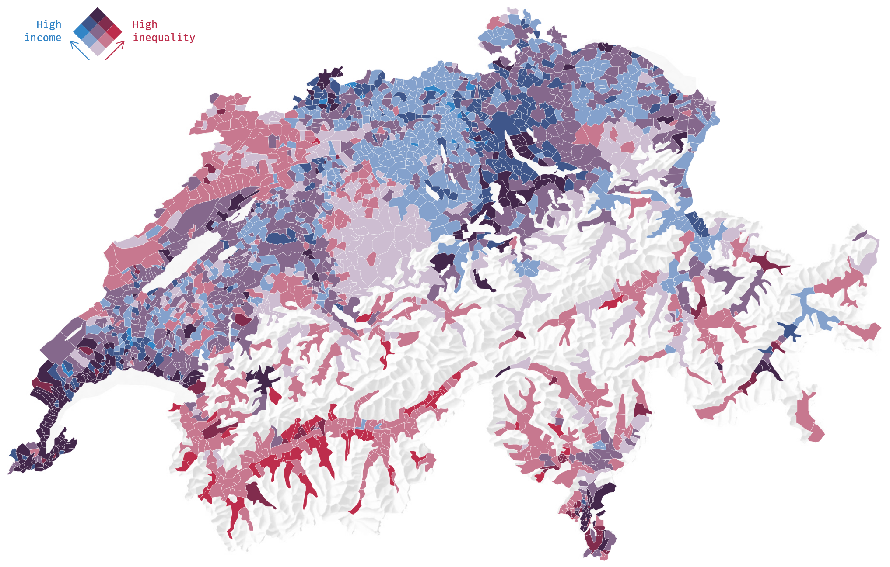

# Bivariate maps with react and d3

Read more about how to map Swiss coordinates (LV95, CH1903+) in these blog-posts:

- [Mapping Swiss coordinates (LV95) with d3: Part 1](https://blog.az.sg/posts/mapping-switzerland-1/)
- [Mapping Swiss coordinates (LV95) with d3: Part 2](https://blog.az.sg/posts/mapping-switzerland-2/)

It is the `react` + `d3` version of the bivariate choropleth map with `ggplot` + `sf` as described in this [this blogpost](https://timogrossenbacher.ch/2019/04/bivariate-maps-with-ggplot2-and-sf/).

The use of react is hereby not sctrictly necessary and much of the code found in `SwissMap.js` is also valid for other programming environments.

The result looks like this:

This project was bootstrapped with [Create React App](https://github.com/facebook/create-react-app).

## Available Scripts

In the project directory, you can run:

### `yarn start`

Runs the app in the development mode. 
Open [http://localhost:3000](http://localhost:3000) to view it in the browser.

The page will reload if you make edits. 
You will also see any lint errors in the console.

### `yarn test`

Launches the test runner in the interactive watch mode. 
See the section about [running tests](https://facebook.github.io/create-react-app/docs/running-tests) for more information.

### `yarn build`

Builds the app for production to the `build` folder. 
It correctly bundles React in production mode and optimizes the build for the best performance.

The build is minified and the filenames include the hashes. 
Your app is ready to be deployed!

See the section about [deployment](https://facebook.github.io/create-react-app/docs/deployment) for more information.

## Learn More

You can learn more in the [Create React App documentation](https://facebook.github.io/create-react-app/docs/getting-started).

To learn React, check out the [React documentation](https://reactjs.org/).
